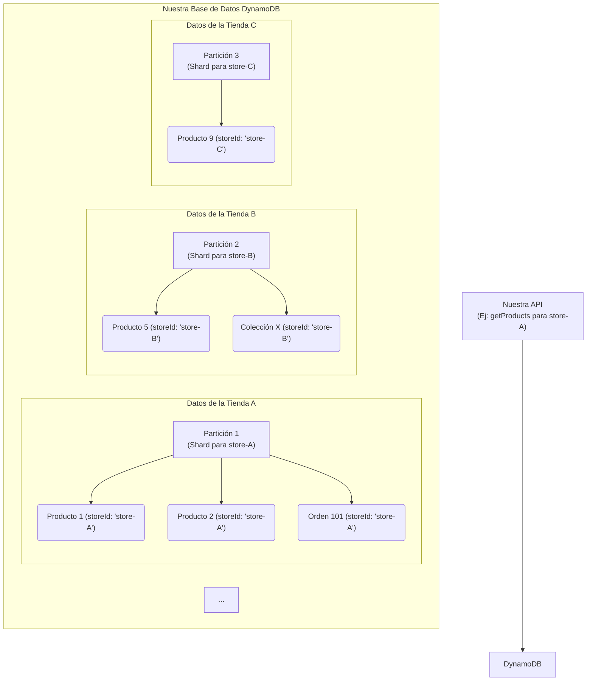

# Nuestra Estrategia de Sharding de Base de Datos con Amplify y DynamoDB

## 1. Introducción: Nuestro Enfoque sobre Sharding y por qué es Crucial

Hemos diseñado la arquitectura de base de datos de la plataforma utilizando una técnica conocida como **Sharding** (o particionamiento). Para una aplicación multi-tenant como la nuestra, donde cada tienda es un "inquilino" independiente, esta estrategia es fundamental.

Decidimos implementar sharding por estas cuatro razones clave:

- **Aislamiento de Datos**: Para evitar que la carga de trabajo de una tienda grande afecte el rendimiento de las demás.
- **Escalabilidad Horizontal**: A medida que agregamos más tiendas, simplemente se añaden más shards. La capacidad de la base de datos crece linealmente con el negocio.
- **Rendimiento**: Las consultas a un shard más pequeño son mucho más rápidas que a una tabla monolítica gigante.
- **Alta Disponibilidad**: Si un shard tiene problemas, solo afecta a las tiendas que aloja, no a toda la plataforma.

## 2. La Solución Nativa: Cómo Aprovechamos Amplify Gen 2 y Amazon DynamoDB

La gran ventaja del stack tecnológico que elegimos es que ya nos proporciona un sistema de sharding robusto y automático. Esto significa que **no tuvimos que implementar un sistema de sharding manual.**

- **Amazon DynamoDB**, la base de datos NoSQL que Amplify Gen 2 utiliza por defecto para los modelos de datos (`@model`), está diseñada desde cero para la escalabilidad masiva a través del **particionamiento automático**.
- DynamoDB distribuye los datos en múltiples servidores (particiones) basándose en una **clave de partición** que definimos en el esquema.

Por lo tanto, nuestro trabajo no fue implementar el sharding, sino **modelar los datos correctamente** para que DynamoDB pudiera aplicar su magia de particionamiento de la manera más eficiente posible.

## 3. La Clave de Nuestra Arquitectura: El Modelado de Datos

El secreto para un sharding efectivo en DynamoDB es elegir la **Clave de Partición (Partition Key - PK)** correcta.

> Una **Clave de Partición** es un atributo (como `storeId`, `userId`, `email`, etc.) que DynamoDB utiliza para agrupar y distribuir los datos en diferentes particiones. Todos los elementos con la misma clave de partición se almacenan juntos.

Una buena clave de partición tiene una alta cardinalidad (muchos valores únicos) y distribuye las solicitudes de lectura/escritura de manera uniforme. Para nuestra plataforma de e-commerce multi-tenant, la elección fue natural y clara.

### `storeId` como Clave de Partición Principal

Para la gran mayoría de nuestros modelos de datos (`Product`, `Collection`, `Order`, `Page`, etc.), decidimos que el atributo **`storeId` era la clave de partición ideal**.

Al definir `storeId` como la clave de partición en nuestros modelos de Amplify, logramos un **sharding a nivel de tienda** de forma automática.



**Los beneficios que obtenemos con esta estrategia son:**

1.  **Aislamiento y Rendimiento**: Todas las operaciones para una tienda específica (ej. listar productos de `store-A`) se dirigen directamente a una única partición. Esto es extremadamente rápido y aísla la carga de trabajo, evitando el problema del "vecino ruidoso".
2.  **Escalabilidad Infinita**: Cuando una nueva tienda se registra, obtiene un nuevo `storeId`. DynamoDB creará automáticamente una nueva partición (o reutilizará una con espacio) para los datos de esa nueva tienda. Podemos agregar miles de tiendas y el sistema escalará horizontalmente sin que tengamos que hacer nada.
3.  **Consultas Eficientes**: Las consultas filtradas por `storeId` son las más eficientes posibles en DynamoDB.

## 4. Implementación en Nuestro Esquema de Amplify

Para implementar esta estrategia, utilizamos la directiva `@index` en nuestros modelos de datos de Amplify. Esto le indica a DynamoDB que cree un **Índice Secundario Global (GSI)**, que es esencialmente una copia de la tabla particionada por una clave diferente.

Así es como lo aplicamos a nuestros modelos existentes.

### Ejemplo: Modelo `Product`

**`amplify/data/models/product.ts`**

```typescript
import { a, defineData, type ClientSchema } from '@aws-amplify/backend';

// ... (otros modelos)

const schema = a.schema({
  // ...

  Product: a
    .model({
      storeId: a.string().required(), // ✅ Nuestra clave de partición
      slug: a.string().required(),
      // ... otros campos
      title: a.string().required(),
      description: a.string(),
      price: a.string().required(),
      // ... más campos

      // 👇 Definimos la relación para el sharding por tienda
      store: a.belongsTo('UserStore', 'storeId'),
    })
    .authorization((allow) => [
      allow.owner(),
      allow.authenticated('identityPool').to(['read']),
      allow.guest().to(['read']),
    ])
    .secondaryIndexes((index) => ({
      // Este índice crea el "shard" por tienda.
      byStore: index('storeId'),
    })),

  // ... (otros modelos)
});
```

Al añadir `.secondaryIndexes(index => ({ byStore: index('storeId') }))`, Amplify configura un GSI donde `storeId` es la clave de partición. Esto nos permite hacer consultas ultra-rápidas para obtener todos los productos de una tienda específica.

### Ejemplo: Modelo `Collection`

**`amplify/data/models/collection.ts`**

```typescript
// ...

const schema = a.schema({
  // ...

  Collection: a
    .model({
      storeId: a.string().required(), // ✅ Nuestra clave de partición
      slug: a.string().required(),
      title: a.string().required(),
      // ... otros campos

      store: a.belongsTo('UserStore', 'storeId'),
      products: a.hasMany('Product', 'collectionId'),
    })
    .authorization((allow) => [
      allow.owner(),
      allow.authenticated('identityPool').to(['read']),
      allow.guest().to(['read']),
    ])
    .secondaryIndexes((index) => ({
      // Sharding por tienda para colecciones
      byStore: index('storeId'),
    })),

  // ... (otros modelos)
});
```

Aplicamos esta misma lógica a todos los modelos que pertenecen a una tienda: `Order`, `Page`, `Cart`, `NavigationMenu`, etc.

## 5. Nuestra Solución para Consultas por Otros Atributos

El sharding por `storeId` resuelve el 90% de nuestros casos de uso. Pero, ¿qué pasa si necesitamos encontrar un usuario por su `email` en **todas** las tiendas?

Para esto, la solución fue crear otro **Índice Secundario Global (GSI)**. Un GSI es como tener otra tabla shardeada, pero con una clave de partición diferente.

**Ejemplo: Modelo `User`**

```typescript
const schema = a.schema({
  User: a
    .model({
      userId: a.string().required(),
      email: a.string().required(),
      // ... otros campos
    })
    .authorization((allow) => [allow.owner()])
    .secondaryIndexes((index) => ({
      // GSI para buscar usuarios por email en toda la plataforma
      byEmail: index('email'),
    })),
});
```

Con `byEmail: index('email')`, DynamoDB mantiene un índice separado particionado por `email`, permitiéndonos buscar usuarios de manera eficiente sin tener que escanear toda la base de datos.

## 6. Conclusión de Nuestra Implementación

- **No necesitamos construir un sistema de sharding**: Amplify y DynamoDB ya lo hacen por nosotros.
- **La clave de nuestra implementación fue el modelo de datos**: Nos enfocamos en diseñar nuestro `schema.ts`.
- **Decidimos usar `storeId` como clave de partición** para la mayoría de nuestros modelos. Esto nos da aislamiento, escalabilidad y rendimiento a nivel de tienda.
- **Usamos Índices Secundarios Globales (GSIs)** para habilitar patrones de consulta adicionales (ej. buscar por email, por slug, etc.).

Al seguir esta estrategia, hemos construido una base sólida que puede escalar desde unas pocas tiendas hasta millones, sin necesidad de rediseñar la arquitectura de base de datos en el futuro.
