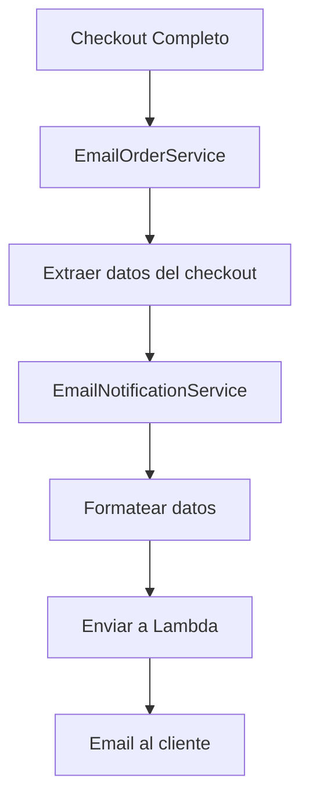
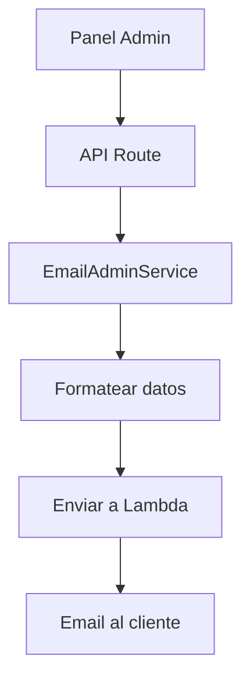

# Arquitectura de Servicios de Email

Esta documentación explica la arquitectura y separación de responsabilidades de los servicios de email en el sistema Fasttify.

## Estructura de Servicios

### 1. Motor de Renderizado

**Ubicación:** `packages/renderer-engine/services/notifications/`

**Servicios:**

- `EmailNotificationService` - Confirmación de pedidos del checkout
- `EmailOrderService` - Integración con el flujo de checkout
- `EmailFormattingUtils` - Utilidades de formateo (reutilizables)

**Propósito:** Servicios para el motor de renderizado y flujo de checkout

### 2. Panel de Administración

**Ubicación:** `app/store/services/`

**Servicios:**

- `EmailAdminService` - Actualizaciones de estado desde el panel admin

**Propósito:** Servicios específicos del panel de administración

## Separación de Responsabilidades

### Por Contexto de Uso

| Servicio                   | Ubicación                   | Contexto             | Usuario       | Propósito                |
| -------------------------- | --------------------------- | -------------------- | ------------- | ------------------------ |
| `EmailNotificationService` | `packages/renderer-engine/` | Motor de Renderizado | Sistema       | Confirmación automática  |
| `EmailOrderService`        | `packages/renderer-engine/` | Checkout             | Sistema       | Integración con checkout |
| `EmailAdminService`        | `app/store/services/`       | Panel Admin          | Administrador | Notificaciones manuales  |
| `EmailFormattingUtils`     | `packages/renderer-engine/` | Compartido           | Ambos         | Utilidades de formateo   |

### Por Tipo de Email

| Tipo de Email           | Servicio Responsable       | Ubicación   | Template              |
| ----------------------- | -------------------------- | ----------- | --------------------- |
| Confirmación de Pedido  | `EmailNotificationService` | Motor       | `order-confirmation`  |
| Actualización de Estado | `EmailAdminService`        | Panel Admin | `order-status-update` |

## Flujo de Emails

### Flujo de Confirmación de Pedido (Motor de Renderizado)



### Flujo de Actualización de Estado (Panel Admin)



## Estructura de Archivos

```
packages/renderer-engine/services/notifications/
├── index.ts                           # Exportaciones del motor
├── email-notification-service.ts      # Confirmaciones del motor
├── email-order-service.ts             # Integración checkout
├── email-formatting-utils.ts          # Utilidades compartidas
├── status-translations.ts             # Traducciones de estados
└── currency-config.ts                 # Configuración de monedas

app/store/services/
├── index.ts                           # Exportaciones del panel admin
└── email-admin-service.ts             # Actualizaciones del panel admin

app/api/v1/notifications/
├── send-order-confirmation/           # API para confirmaciones
└── send-order-status-update/          # API para actualizaciones
```

## Uso en el Código

### Para Emails del Motor de Renderizado

```typescript
import { EmailNotificationService } from '@/packages/renderer-engine/services/notifications';

// En el flujo de checkout
await EmailNotificationService.sendOrderConfirmation({
  order: orderData,
  storeName: 'Mi Tienda',
  customerName: 'Juan Pérez',
  shippingAddress: addressData,
  billingAddress: addressData,
});
```

### Para Emails del Panel Admin

```typescript
import { EmailAdminService } from '@/app/store/services';

// Desde el panel admin
await EmailAdminService.sendOrderStatusUpdate({
  orderId: 'ORD-123',
  customerEmail: 'cliente@ejemplo.com',
  customerName: 'Juan Pérez',
  storeName: 'Mi Tienda',
  previousOrderStatus: 'confirmed',
  newOrderStatus: 'shipped',
  previousPaymentStatus: 'paid',
  newPaymentStatus: 'paid',
  orderTotal: '$89.900,00',
  orderDate: '29 de agosto de 2025',
  updateNotes: 'Tu pedido ha sido enviado',
});
```

### Para Utilidades de Formateo

```typescript
import { EmailFormattingUtils } from '@/packages/renderer-engine/services/notifications';

// Formatear datos (disponible en ambos contextos)
const formattedAddress = EmailFormattingUtils.formatAddress(addressData);
const formattedCurrency = EmailFormattingUtils.formatCurrency(amount, 'COP');
const customerName = EmailFormattingUtils.extractCustomerName(customerInfo);
```

## Beneficios de la Separación

### 1. **Separación por Contexto**

- Servicios del motor de renderizado separados del panel admin
- Fácil mantenimiento y debugging por contexto
- Cambios independientes por área de la aplicación

### 2. **Escalabilidad**

- Servicios pueden evolucionar independientemente
- Fácil agregar nuevos tipos de emails por contexto
- Reutilización de utilidades comunes

### 3. **Mantenibilidad**

- Código más organizado y fácil de entender
- Menor acoplamiento entre componentes
- Testing más específico y enfocado

### 4. **Flexibilidad**

- Diferentes configuraciones por contexto
- Fácil personalización por tipo de usuario
- Integración independiente con diferentes sistemas

## Consideraciones de Diseño

### 1. **Reutilización de Código**

- Utilidades centralizadas en `EmailFormattingUtils`
- Lógica común de envío a Lambda compartida
- Interfaces consistentes entre servicios

### 2. **Manejo de Errores**

- Cada servicio maneja sus propios errores
- Logs específicos por contexto
- Fallbacks apropiados por tipo de email

### 3. **Configuración**

- Variables de entorno compartidas
- Configuración específica por servicio cuando sea necesario
- Templates de email separados por tipo

### 4. **Testing**

- Tests unitarios por servicio
- Tests de integración por flujo
- Mocks específicos por contexto

## Migración y Evolución

### Agregar Nuevos Tipos de Email

1. **Identificar el contexto:** ¿Es del motor de renderizado o del panel admin?
2. **Elegir la ubicación:** Usar la estructura apropiada según el contexto
3. **Implementar el método:** Seguir los patrones existentes
4. **Actualizar documentación:** Mantener la documentación actualizada

### Modificar Servicios Existentes

1. **Evaluar impacto:** ¿Afecta otros servicios o contextos?
2. **Mantener compatibilidad:** No romper interfaces existentes
3. **Actualizar tests:** Asegurar que los tests sigan pasando
4. **Documentar cambios:** Actualizar esta documentación

Esta separación de servicios asegura que el sistema de emails sea mantenible, escalable y fácil de entender, con responsabilidades claras y bien definidas por contexto de uso.
