# Guía Visual para el Desarrollo de Temas en Fasttify

Esta guía es un complemento práctico y visual a la [Guía de Desarrollo de Temas](theme-development-guide.md). Mientras que la guía principal es una referencia técnica, este documento te llevará paso a paso en la creación de componentes de un tema, con ejemplos extendidos y diagramas.

## 1. La Estructura de un Tema Visualizada

Todo tema en Fasttify comparte una estructura de carpetas común. Entenderla es el primer paso.

```mermaid
graph TD
    A[Tema Raíz] --> B[assets];
    A --> C[config];
    A --> D[layout];
    A --> E[locales];
    A --> F[sections];
    A --> G[snippets];
    A --> H[templates];

    subgraph "Assets"
        B --> B1[theme.css];
        B --> B2[theme.js];
        B --> B3[logo.png];
    end

    subgraph "Configuración"
        C --> C1[settings_schema.json];
    end

    subgraph "Layout Principal"
        D --> D1[theme.liquid];
    end

    subgraph "Traducciones"
        E --> E1[en.default.json];
    end

    subgraph "Bloques de Página"
        F --> F1[hero-banner.liquid];
        F --> F2[product-list.liquid];
    end

    subgraph "Componentes Reutilizables"
        G --> G1[product-card.liquid];
        G --> G2[icon-cart.liquid];
    end

    subgraph "Plantillas de Página"
        H --> H1[index.json];
        H --> H2[product.json];
    end

    style B fill:#f9f,stroke:#333,stroke-width:2px;
    style C fill:#ccf,stroke:#333,stroke-width:2px;
    style D fill:#cfc,stroke:#333,stroke-width:2px;
    style E fill:#ffc,stroke:#333,stroke-width:2px;
    style F fill:#fcf,stroke:#333,stroke-width:2px;
    style G fill:#cff,stroke:#333,stroke-width:2px;
    style H fill:#ff9,stroke:#333,stroke-width:2px;
```



- **`assets`**: Tus archivos estáticos. Todo lo que pongas aquí será accesible públicamente.
- **`config`**: Define las opciones de personalización globales de tu tema.
- **`layout`**: Contiene la plantilla base (`theme.liquid`) que envuelve a todas las demás.
- **`sections`**: Los componentes principales y modulares de tus páginas.
- **`snippets`**: Pequeños fragmentos de código reutilizables, ideales para no repetir HTML.
- **`templates`**: Archivos `.json` que definen qué secciones componen cada tipo de página (inicio, producto, etc.).

## 2. El Corazón del Tema: `layout/theme.liquid`

Este es el esqueleto de tu tienda. Cada página se renderizará dentro de este archivo.

Un `theme.liquid` básico se ve así:

```liquid
<!DOCTYPE html>
<html lang="{{ shop.locale }}">
<head>
  <meta charset="UTF-8">
  <meta name="viewport" content="width=device-width, initial-scale=1.0">

  <title>{{ page_title }}</title>

  <!-- Inyección automática de CSS y Metadatos -->
  {{ content_for_header }}

  <!-- Carga de CSS principal del tema -->
  {{ 'theme.css' | asset_url | stylesheet_tag }}
</head>
<body>

  

  <main role="main">
    <!-- Aquí se renderiza el contenido de cada página -->
    {{ content_for_layout }}
  </main>

  

  <!-- Carga de JS principal del tema -->
  <script src="{{ 'theme.js' | asset_url }}" defer="defer"></script>

  <!-- Inyección automática de JS de las secciones -->
  {{ content_for_footer }}

</body>
</html>
```

**Variables Clave:**

- **`{{ page_title }}`**: El título de la página actual, optimizado para SEO.
- **`{{ content_for_header }}`**: Un marcador de posición mágico. El motor de Fasttify inyecta aquí metadatos importantes, el CSS de las secciones y otras etiquetas necesarias para el `<head>`. **Nunca lo elimines.**
- **`{{ content_for_layout }}`**: Otro marcador mágico. Aquí es donde se insertará el contenido renderizado de `templates/index.json`, `templates/product.json`, etc. Es el contenido principal y dinámico de la página.
- **``**: Renderiza la sección del encabezado, que es común a todas las páginas.

## 3. Creando una Sección: Un Banner de Héroe

Vamos a crear una sección `hero-banner.liquid` desde cero.

### Paso 3.1: Definir el `schema`

Primero, definimos las opciones que el comerciante podrá personalizar.

**`sections/hero-banner.liquid`**

```liquid

  Este es el código Liquid de nuestra sección



{
  "name": "Banner de Héroe",
  "settings": [
    {
      "type": "image_picker",
      "id": "background_image",
      "label": "Imagen de fondo"
    },
    {
      "type": "text",
      "id": "title",
      "label": "Título Principal",
      "default": "Tu Tienda Increíble"
    },
    {
      "type": "richtext",
      "id": "subtitle",
      "label": "Subtítulo",
      "default": "<p>Productos únicos y de alta calidad.</p>"
    },
    {
      "type": "text",
      "id": "button_text",
      "label": "Texto del Botón",
      "default": "Ver Productos"
    },
    {
      "type": "url",
      "id": "button_link",
      "label": "Enlace del Botón"
    },
    {
      "type": "color",
      "id": "text_color",
      "label": "Color del Texto",
      "default": "#FFFFFF"
    }
  ]
}

```

### Paso 3.2: Escribir el HTML con Liquid

Ahora, usamos los `settings` que definimos para construir el HTML.

**`sections/hero-banner.liquid` (continuación)**

```liquid
<div class="hero-banner" style="background-image: url('{{ section.settings.background_image | img_url: '1800x' }}');">
  <div class="hero-banner__content">
    <h1 class="hero-banner__title">{{ section.settings.title }}</h1>
    <div class="hero-banner__subtitle">
      {{ section.settings.subtitle }}
    </div>
    
      <a href="{{ section.settings.button_link }}" class="hero-banner__button">
        {{ section.settings.button_text }}
      </a>
    
  </div>
</div>
```

### Paso 3.3: Añadir Estilos Encapsulados

Agregamos CSS que solo se aplicará a esta sección, usando los valores del `schema` para hacerlo dinámico.

**`sections/hero-banner.liquid` (continuación)**

```liquid

  .hero-banner {
    display: flex;
    align-items: center;
    justify-content: center;
    text-align: center;
    padding: 100px 20px;
    background-size: cover;
    background-position: center;
    color: {{ section.settings.text_color }};
  }
  .hero-banner__title {
    font-size: 48px;
    margin-bottom: 15px;
  }
  .hero-banner__subtitle {
    font-size: 20px;
    margin-bottom: 30px;
  }
  .hero-banner__button {
    background-color: {{ section.settings.text_color }};
    color: #000000; /* Asumimos que el color de fondo será el opuesto */
    padding: 12px 25px;
    text-decoration: none;
    border-radius: 5px;
    font-weight: bold;
  }

```

## 4. Usando Nuestra Sección en una Plantilla

Ahora, para que nuestro banner aparezca en la página de inicio, lo añadimos a `templates/index.json`.

**`templates/index.json`**

```json
{
  "sections": {
    "hero": {
      "type": "sections/hero-banner",
      "settings": {
        "title": "¡Ofertas de Verano!",
        "button_link": "/collections/ofertas"
      }
    },
    "featured-products": {
      "type": "sections/product-list",
      "settings": {
        "title": "Nuestros Favoritos"
      }
    }
  },
  "order": ["hero", "featured-products"]
}
```

- `"hero"`: Es un nombre único que le damos a esta instancia de la sección.
- `"type": "sections/hero-banner"`: Le dice al motor que cargue el archivo `/sections/hero-banner.liquid`.
- `"settings"`: Sobrescribimos el título por defecto y definimos un enlace para el botón, solo para esta instancia en la página de inicio.
- `"order"`: Le decimos al motor que renderice primero el `hero` y luego `featured-products`.

## 5. El Flujo de Renderizado Visualizado

Para juntar todo, aquí tienes un diagrama que muestra el flujo de renderizado para nuestra página de inicio:

```mermaid
graph TD
    A["Visita a la Homepage"] --> B{"Motor de Renderizado"};
    B --> C["Lee /templates/index.json"];
    C --> D{"Analiza 'order': &#91;'hero', 'featured-products'&#93;"};

    subgraph "Renderiza Sección 'hero'"
        D --> E["Busca 'hero' en 'sections'"];
        E --> F{"Carga /sections/hero-banner.liquid"};
        F --> G["Aplica 'settings' de index.json"];
        G --> H["Renderiza HTML y recolecta CSS"];
    end

    subgraph "Renderiza Sección 'featured-products'"
        D --> I["Busca 'featured-products' en 'sections'"];
        I --> J{"Carga /sections/product-list.liquid"};
        J --> K["Aplica 'settings' de index.json"];
        K --> L["Renderiza HTML y recolecta CSS"];
    end

    H --> M["Contenido HTML Combinado"];
    L --> M;

    M --> N{"Carga /layout/theme.liquid"};
    N --> O["Inyecta contenido en 'content_for_layout'"];
    H --> P["CSS Recolectado"];
    L --> P;
    P --> Q["Inyecta CSS en 'content_for_header'"];

    O --> R["Página Final"];
    Q --> R;
```



¡Y eso es todo! Has visto el ciclo completo de cómo se construye una página en Fasttify. Con estos conceptos, estás listo para explorar y crear temas complejos y atractivos.

## 6. Snippets: Creando Componentes Reutilizables

Los Snippets son la clave para no repetir código. Son pequeños fragmentos de HTML y Liquid que puedes `renderizar` desde cualquier sección o plantilla. Un caso de uso perfecto es la "tarjeta de producto".

### Paso 6.1: Crear el Snippet `product-card.liquid`

Este snippet recibirá un objeto `product` y mostrará su información.

**`snippets/product-card.liquid`**

```liquid
<div class="product-card">
  <a href="{{ product.url }}" class="product-card__link">
    <div class="product-card__image-wrapper">
      
    </div>
    <div class="product-card__info">
      <h3 class="product-card__title">{{ product.title }}</h3>
      <div class="product-card__price">
        <span>{{ product.price | money }}</span>
        
          <s class="product-card__compare-price">{{ product.compare_at_price | money }}</s>
        
      </div>
    </div>
  </a>
</div>
```

**Nota**: `product` aquí es una variable local. Su valor se lo pasaremos desde la sección que lo renderice.

## 7. Secciones con Lógica: La Lista de Productos Destacados

Ahora, creemos una sección que muestre una cuadrícula de productos utilizando nuestro nuevo snippet `product-card`.

**`sections/featured-products.liquid`**

```liquid

  Schema para definir el título y la colección a mostrar.


{
  "name": "Productos Destacados",
  "settings": [
    {
      "type": "text",
      "id": "title",
      "label": "Título de la sección",
      "default": "Productos Destacados"
    },
    {
      "type": "collection",
      "id": "featured_collection",
      "label": "Seleccionar Colección"
    },
    {
      "type": "range",
      "id": "products_to_show",
      "min": 2,
      "max": 12,
      "step": 2,
      "label": "Productos a mostrar",
      "default": 4
    }
  ]
}



  .featured-products-grid {
    display: grid;
    grid-template-columns: repeat(auto-fill, minmax(250px, 1fr));
    gap: 20px;
  }
  .featured-products-header {
    text-align: center;
    margin-bottom: 40px;
  }


<div class="page-width">
  <div class="featured-products-header">
    <h2>{{ section.settings.title }}</h2>
  </div>

  
  <div class="featured-products-grid">
    
      
    
      
         Mostrar placeholders si no hay productos 
        <div class="product-card placeholder">
          <div class="product-card__image-wrapper"></div>
          <div class="product-card__info"></div>
        </div>
      
    
  </div>
</div>
```

**Puntos Clave:**

- **`assign collection = ...`**: Obtenemos el objeto completo de la colección a partir del handle que el comerciante seleccionó en el `schema`.
- **`for product in collection.products`**: Iteramos sobre los productos de esa colección.
- **`limit: section.settings.products_to_show`**: Usamos el valor del `schema` para limitar cuántos productos se muestran.
- **``**: Aquí está la magia. Llamamos a nuestro snippet y le pasamos la variable `product` del bucle. El snippet ahora tendrá acceso a un objeto `product` con los datos del producto actual en la iteración.

## 8. Configuración Global del Tema

Para opciones que afectan a todo el sitio (colores, fuentes, etc.), usamos `config/settings_schema.json`.

**`config/settings_schema.json`**

```json
[
  {
    "name": "Colores",
    "settings": [
      {
        "type": "color",
        "id": "color_accent",
        "label": "Color de Acento",
        "default": "#FF5733"
      },
      {
        "type": "color",
        "id": "color_body_text",
        "label": "Color del Texto Principal",
        "default": "#333333"
      }
    ]
  },
  {
    "name": "Tipografía",
    "settings": [
      {
        "type": "font_picker",
        "id": "font_heading",
        "label": "Fuente para Títulos",
        "default": "helvetica_n4"
      }
    ]
  }
]
```

Ahora, puedes acceder a estos valores en **cualquier archivo Liquid** a través del objeto `settings`.

**Ejemplo en `theme.liquid`:**

```liquid
<style>
  body {
    color: {{ settings.color_body_text }};
  }
  h1, h2, h3 {
    font-family: {{ settings.font_heading.family }}, {{ settings.font_heading.fallback_families }};
    font-weight: {{ settings.font_heading.weight }};
  }
  a:hover {
    color: {{ settings.color_accent }};
  }
</style>
```

## 9. Internacionalización (i18n)

Para que tu tema pueda ser traducido, usa el sistema de `locales`.

**1. Define tus textos en `locales/en.default.json` (Inglés por defecto):**

```json
{
  "general": {
    "search": "Search"
  },
  "products": {
    "add_to_cart": "Add to Cart",
    "sold_out": "Sold Out"
  }
}
```

**2. Usa el filtro `t` en tu código Liquid:**
En lugar de escribir texto directamente en tus plantillas:

```liquid
<button type="submit">Add to Cart</button>
```

Usa la clave de traducción:

```liquid
<button type="submit">{{ 'products.add_to_cart' | t }}</button>
```

El motor de Fasttify buscará la clave (`products.add_to_cart`) en el archivo de idioma correspondiente y mostrará el texto correcto. Esto hace que tu tema esté listo para ser traducido a múltiples idiomas simplemente añadiendo nuevos archivos JSON a la carpeta `locales` (ej. `es.json`).
